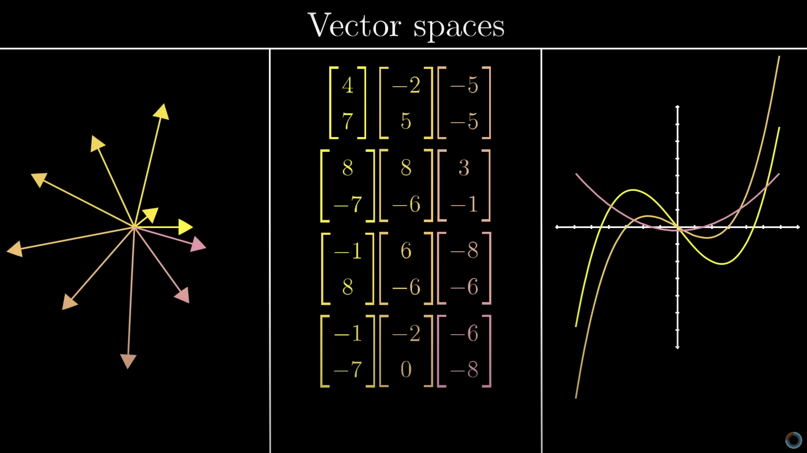
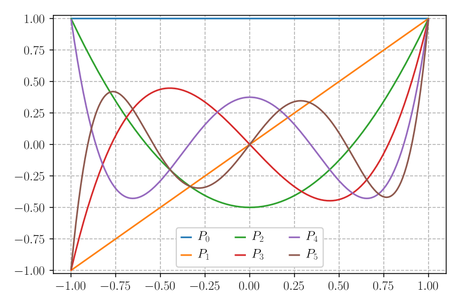
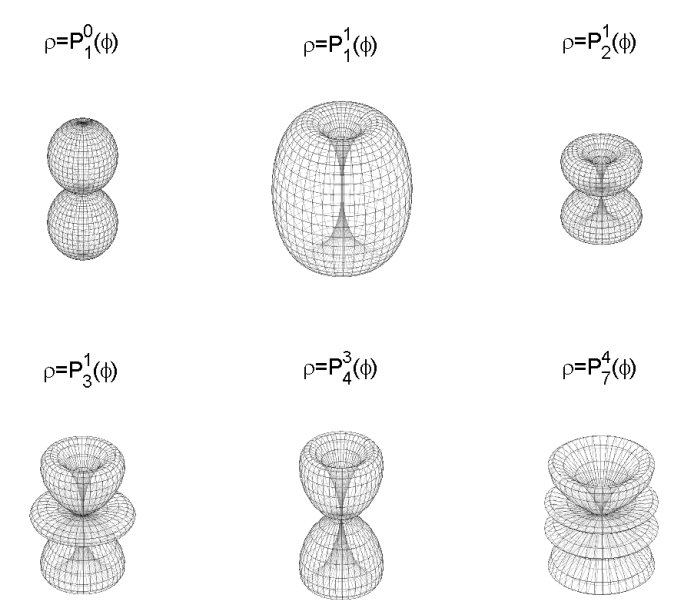
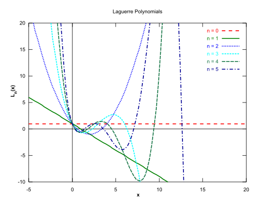

Functional Analysis and the study of Basis Functions
=========================

Functional Analysis consists on the study of vector spaces and operations on that spaces that obey special kinds of properties defined to it. The most common example of such study subject is 
an n-dimensional real vector, that is an object that lives in $\mathbb{R}^n$ space. They obey certain rules related to dot products and norms while having operations done on them like linear maps
done through matrices. 

In a more general sense, it is possible to introduce an infinite dimensional complex vector space with inner product and norms, that is, a Hilbert space, in which vectors and functions become one and the same. With this vector behavior of functions, then all general theorems for vectors apply to functions providing advantages in their computation, representation, and operations. One of these advantages is the selection of special basis that can be used to represent any function by a linear combination of the basis just like in the case of vectors.
Such selection of basis functions should span the whole Hilbert Space.

As in linear algebra, there exist sets of orthogonal basis in which functions are orthogonal. For functions, orthogonality is defined in terms of the inner product being 0, in which these inner products are computed as integrals of the product of the two input functions.[^2] The usefulness of orthogonal polynomials comes from the ability to decompose any function into the linear combination of orthogonal functions and then utilize mathematical relations that can be apply in general to the orthogonal basis.

Orthogonal polynomials are used in many areas such as differential and integral equations, interpolation, numerical integration with Quadrature rules, eigenvalue problems, conformal mapping, and polynomial chaos in statistics.[^1][^3]

## Table of Contents
1. [History](#history)
2. [Mathematical Background](#mathematical-background)
3. [Basis Functions](#basis-functions)
4. [Orthogonal Functions](#orthogonal-functions)
    1. [Orthogonal Polynomials](#orthogonal-monomials)
    2. [Legendre Polynomials](#legendre-polynomials)
    3. [Laguerre Polynomials](#laguerre-polynomials)
    4. [Jacobi Polynomials](#jacobi-polynomials)
    5. [Other orthogonal functions](#other-orthogonal-functions)
        1. [Fourier Series](#fourier-series)
        2. [Rational Functions](#rational-functions)
5. [Numerical Analysis](#numerical-analysis)
6. [Examples](#examples)
7. [Further Reading](#further-reading)
8. [References](#references)

## History
While the idea of functions as quantities varying with respect to other parameters existed in the astronomical texts of ancient Greeks of the 100s BCE and in the works of the Persian mathematician Al-Biruni from the 11th century, the concrete and formal definition came from the development of Calculus from Leibniz, John Bernoulli, and Newton during the 19th Century.[^7]

Meanwhile, vectors appeared vaguely as in idea for grouping variables for solving systems of linear equations, mainly through the introduction of linear equations by Rene Descartes with geometry in 1637.[^8] It was not until 1844 that the core foundations of linear algebra took root from the publication "Theory of Extension" by Hermann Grassman. Here the concepts of linear combinations, basis, change of basis, subspaces, etc. are born. [^9]  Later this concepts would even be expanded to complex numbers such as the appearance of quaternions. However, the concept of vectors was completely based on linear algebra's matrices and linear equations, not an abstract malleable mathematical construct. Then, in 1888 Giuseppe Peano introduced the modern idea of abstract vector spaces. He proposed 4 concrete definitions that an _entity_ would follow, providing examples of such systems and even proposing the possibility of infinite dimensional vector spaces.[^4]

From Peano's realization, soon the idea of functions and infinite dimensional vector spaces would follow. In the 20th century the ideas of sequences and spaces of functions could be thought as vector spaces, yet the introduction of integral equations[^10], specifically two-square integrable functions that can have an inner product defined on an interval, showed its share of similarities with the Euclidean dot product. This ideas were presented by David Hilbert and Enrad Schmidt[^11]. Here the concept of functions as vector began to take shape as the definitions of orthogonality along with proofs of spectral decomposition. These key ideas would play a major role in defining a mathematical foundation in Quantum Mechanics, but its usefulness would travel far beyond from it.

By allowing functions and polynomials to be an element in a vector space, it allowed the possibilities for the selection of special sets of functions and the study of their properties. This way, the area of mathematics of Functional Analysis was born. Many of such special function sets have been compiled having different properties some of which we will present in this text.

## Mathematical Background
To understand in what sense functions are treatable as vectors, we present the definition of a _vector_, and proceed with some relations that may be useful for understanding the concept.

A vector space over a _number system_ $F$ (e.g. Integers $\mathbb{Z}$, Real $\mathbb{R}$, Complex $\mathbb{C}$, etc.) is a set $V$ that satisfies the following properties:[^12]

1. Associativity of Vector Addition: $\vec{u} + (\vec{v} + \vec{w}) = (\vec{u} + \vec{v}) + \vec{w}$
2. Communtativity of Vector Addition: $\vec{u} + \vec{v} = \vec{v} + \vec{u}$
3. Identity element of Vector Addition: $\vec{u} + \vec{0}= \vec{u}$
4. Inverse element of Vector Addition: $\vec{u} + (-\vec{u}) = \vec{0}$
5. Associativity of Scalar Multiplication: $(ab)\vec{u}=a(b\vec{u})$
6. Distributivity of Scalar Multiplication: $a(\vec{u} + \vec{v}) = a\vec{u} + a\vec{v}$ and $(a + b)\vec{u} = a\vec{u} + b\vec{u}$
7. Identity element of Scalar Multiplication: $1\vec{u} = \vec{u}$

where $\vec{u}$, $\vec{v}$ and $\vec{0}$ are elements in $V$ and $a,b$, and 1 are numbers in $F$.

These are the axioms, i.e. the definition or _statement assumed true without proof_, of vector spaces
Intuitively, for _geometrical_ vectors, this can be shown visually to be consistent to how vectors should behave.

*Geometric, Matrix, and Analytical representations of vector spaces[^21]*

Now, if we translate this concepts to functions, these properties still apply:
$(f+g)(x) = f(x) + g(x)$, $1f(x)=f(x)$, $a(f(x) + g(x)) = af(x) + ag(x)$, ... So, in essence, we can think of function and vectors as one and the same thing.

For the operation of __dot product__, more generally known as __inner product__, of a $n$-diemnsional vector with basis vectors $\hat{e_i}$ is defined as:
$$\vec{u}\cdot\vec{v}=\sum^n_{i=1}u_iv_i$$
with
$$u = \sum^n_{i=1}u_i\hat{e_i}$$
A function is a continous throughout is domain with infinitely many inputs, so a discrete definition with sumations will not work as it will diverge; therefore, the resolution occurs with defining the inner product with the continuous equivalent of the summation, the integral:

The inner product of two real functions $f$ and $g$ in the vector space $V$ over the interval $[a,b] is defined as:
$$
    \braket{f,g} = \int^b_af(x)\,g(x)\;\text{d}{x}
$$

More generally, functions can be complex and inner products can have specific weights depending on the topology[^2]:

$$\braket{f,g}_w = \int^b_af^*(x)\,g(x)\,w(x)\;\text{d}{x}$$

where $f^*$ is the complex conjugate of $f$ and $w$ is the weigth of this particular inner product. Vector spaces that contain the inner product space are said to be __Inner Product Spaces__.

With this definition of inner products, it is also possible to define the norm of the function for the given interval. The __Euclidean Norm__, also called $L^2$ in the literature of Hilbert Spaces, for a function $f$ is defined as:

$$\big|\big|f\big|\big|_2 = \sqrt{\braket{f,f}_2} = \sqrt{\int^b_a\big|f(x)\big|^2\;\text{d}{x}}$$

A function is said to be __normalized__ if its Euclidean Norm is equal to 1.

## Basis Functions

One of the main premises for the use of vectors is the ability to write a given vector as a linear combination of other vectors. These _other_ vectors are called __basis vectors__, and the vector space of the complete set of all possible combinations of those basis vectors is called the __span__.
If there is a set of $n$ basis vectors $e_i$ in vector space $V$, any vector $v$ in the subspace spanned by $e_i$, i.e. the span of $e_i$ can be written as:

$$\vec{v} = \sum^n_{i=1}v_i\vec{e_i}$$

The same principle applies to functions. A set function $S=\{\,f_i\;|\;1\leq i\leq n\}$ can represent any function in their span as a linear combination of those basis functions:

$$g(x) = \sum^n_{i=1}c_i\;f_i(x)$$

A simple example of this fact can be shown by a set of two basis functions: $f_0(x) = 1$ and $f_1(x)=x$. From the previous equation, it can be seen that any function $g(x)$ in the span of $\{f_0,f_1\}$ can be written as:
$$g(x) = c_0 + c_1 x$$
This is the equation of a line. Therefore, $g(x)$ can be any linear function or equivalently, the span of this set of basis function is the whole set of linear functions. Analyzing why this is the case, we can think of $c_0$ and $c_1$ as knobs. By only modifying $c_0$, $g(x)$ changes just in the intercept at $x=0$, but not the slope. Similarly, $c_1$ just modifies the slope, so the only linear function possible to construct with it are those that cross the origin. It is only when both can be modified is that the whole set of linear functions is attainable.

This analogy can be tried again with higher powers. If we add $f_2(x) = x^2$ to the set of basis functions, then $g(x)$ becomes:

$$g(x) = c_0 + c_1 x + c_2 x^2$$

The new knob $c_2$ opens the possibilities for $g(x)$ to be a second order polynomial, a quadratic.

By continuously adding more powers to this set, we construct what is called __Monomial Basis__. For a monomial basis with $n$ powers, the functions representable are given by the expression:

$$g(x) = \sum^{n-1}_{i=0}c_ix^i$$

which is just any polynomial of $n-1$ order.

In the case we let the number of monomials $n\to\infty$ for this set, then we would have:

$$g(x) = \sum^\infty_{i=0}c_ix^i$$

However, one must be careful to note that this expression must converge for it to be true. A set of examples of this would be Taylor expansions. For the exponential function, we would have:

$$g(x) = e^x = \sum^\infty_{n=0}\frac{1}{n!}x^n$$

where $c_n = \frac{1}{n!}$

## Orthogonal Functions

Orthogonality is the interesting property of vectors to be linearly independent from other vectors. In geometry, vectors are orthogonal if they are perpendicular. The case in geometry can be generalized by defining orthogonality between two vectors if they satisfy:

$$\braket{\vec{u}, \vec{v}} = 0$$

Again, this translates to functions seamlessly. Two function are orthogonal on the interval $[a,b]$ if[^13]:

$$\braket{f_i\,,\,f_j}_w = \int^b_a\,f_i(x)\;f_j(x)w(x)\;\text{d}x = 0$$

If all the functions in the basis are orthogonal to each other, then the set of function has an orthogonal basis. 

When a functions in an orthogonal basis are normalized, the functions are known to be __orthonormal__ forming an __orthonormal basis__.For the management of orthonormal basis functions, it is useful to introduce the __Kronecker Delta__ function:

$$\delta_{ij} = \large\begin{cases}1 & i = j\\0 & i\neq j\end{cases}$$

so that the inner product of two orthonormal basis function $f_i$ and $f_j$ can be simplified to:

$$\braket{f_i\,,\,f_j} = \delta_{ij}$$

The usefulness of an orthogonal/orthonormal basis comes from the ability to decompose any function spanned by the basis easily. If $g(x)$ is a function in the span of the $f_i$ basis, then it can be written as:

$$g(x) = \sum c_i\;f_i(x)$$

Computing the inner product with a basis function $f_j$:

$$\braket{f_j, g} = \sum{\braket{f_j,c_i\;f_i}} = \sum c_i \delta_{ij} = c_j$$

Hence, the inner product works as a __Projector__ operator by obtaining the coefficient associated to each basis function. Another way of seeing this property is that by having an orthonormal basis, each time an inner product is done with a basis function, the amount of information obtained (the value of the coefficients) is maximized.

With this properties presented, we can proceed to discuss common orthogonal functions used due to their different properties in a very diverse amount of scientific areas.

### Orthogonal Polynomials

The main kind of orthogonal functions used are __Orthogonal Polynomials__. Orthogonal Polynomials are defined with respect to a specific weight and have a definite structure depending on the degree of the polynomial. The three most widely used orthogonal polynomials are the __Classical Orthogonal Polynomials__: the __Jacobi__, __Leguerre__, and __Hermite__ polynomials.[^14]

### Jacobi Polynomials [^15]

The Jacobi Polynomials are defined by the orthogonality relationship:

$$\int^1_{-1} p_m(x)\;p_n(x)\;(1-x)^\alpha\;(1+x)^\beta\;\text{d}x = \frac{2^{\alpha+\beta+1}}{2n+\alpha+\beta+1}\frac{\Gamma(n+\alpha+1)\Gamma(n+\beta+1)}{\Gamma(n+\alpha+\beta+1)n!}\delta_{mn}$$

with $\alpha,\beta>-1$. By using the Rodrigues Formula, a more explicit definition of the Jacobi Polynomials is given by the equation:

$$P_n(x;\alpha;\beta) = \frac{(-1)^n}{n!2^n}(1-x)^{-\alpha}(1+x)^{-\beta}\frac{\text{d}^n}{\text{d}x^n}\left[(1-x)^\alpha(1+x)^\beta(1-x^2)^n\right]$$

Some of the applications of such complex polynomials are in the use spectral methods [^16]

### Legendre Polynomials 

Legendre Polynomials are the special case of Jacobi Polynomials when $\alpha,\beta = 0$. Therefore, they have an easier representation. The orthogonality relation is:

$$\int^1_{-1}P_m(x)\,P_n(x)\; \text{d}x = \frac{2}{2n+1}\delta_{mn}$$

or in the case of its generating function:

$$P_n(x)=\frac{1}{2^nn!}\frac{\text{d}^n}{\text{d}x^n}(1-x^2)^n$$

Due to their straightforward definition, lists of the sequence of the polynomials have been computed. The first six of them are:

$$\begin{split}P_0(x) &= 1\\P_1(x) &= x\\P_2(x) &= \frac{1}{2}(3x^2-1)\\P_3(x) &= \frac{1}{2}(5x^3-3x)\\P_4(x) &= \frac{1}{8}(35x^4-30x^2+3)\\P_5(x) &= \frac{1}{8}(63x^5-70x^3+15x)\end{split}$$

*Graph of the first six Legendre Polynomials[^23]*

The ease of computation facilitates the use of these polynomials all throughout many areas. They are used in Electrodynamics and Mechanics expanding potentials depending with the $1/r$ to provide a general solution to the Laplace Equation. For example, in the azimuthally symmetric separable potential, the general solution to the Laplace Equation is given by: 

$$V(r,\theta) = \sum^\infty_{n=0}\left(A_nr_n+B_n/r^{n+1}\right)P_n(\cos\theta)$$

where $P_n$ are the Legendre Polynomials. These also appear when solving the Schrodinger Equation for a central potential from the nucleus as a function of the alitute angle which define the electron orbitals in atoms in the form of _spherical harmonics_:

$$Y_{mn}(\theta,\phi) = P^m_n(\cos\theta)\cos m\phi$$

*Orbitals' shape predicted by the spherical harmonics (Legendre Polynomial)[^20]*

They are used in the Gauss-Legendre Quadrature Rules for approximating definite integrals. As polynomials are easy to integrate, the weights and points for this quadrature rule are really easy to obtain compared to more general polynomials like the Jacobi Polynomials. Many of this have been computed and stored in reference tables for use when needed. While Legendre Polynomials are a solid choice for Quadratures in the majority of cases, specially for integrating polynomials, its property of computing exact integrals for polynomials will not transfer for any other type function. While inexpensive, there might be methods with better accuracy for more complex functions. [^18]

Recently, they have also gained traction in their usage on Recurrent Neural Network Architectures. These neural networks orthogonalize the time history of the input data. The orthogonalization occurs with shifted Legendre Polynomials. Then these equations are ported into the memory of the neural network as matrices indexed at dsicrete moments in time. [^19]

### Laguerre Polynomials [^2]

Laguerre Polynomials are defined to have the weight: $w(x) = x^\alpha e^{-x}$ with $\alpha>-1$ and $x>0$. From the orthogonalization, the Laguerre polynomials can be written as the sequence:

$$L^\alpha_n(x)=\sum^n_{k=0}\frac{\Gamma(\alpha+n+1)}{\Gamma(\alpha+k+1)}\frac{(-x)^k}{k!(n-k)!}$$

They satisfy the differential equation: 
$$xy''+(\alpha-x+1)y'+ny=0$$
where $n$ is a non-negative integer. This property is important as it permits it to be written as a _confluent hypergeometric function_, which are functions where the singularities are merged into one. Real world use cases for this were in the solution of the Schordinger Equation for the Couloumb Potential and Morse potential. [^22]

The first three generalized Laguerre Polynomials are: 

$$\begin{split}L_0^\alpha(x)&=1\\L_1^\alpha(x)&=-x+\alpha+1\\L_2^\alpha(x)&=\frac{x^2}{2}-(\alpha + 2)x+\frac{(\alpha+1)(\alpha+2)}{2}\end{split}$$

*Graph of the first six Laguerre Polynomials[^24]*

### Hermite Polynomials

### Other orthogonal functions

#### Fourier Series[^6]

#### Rational Functions

#### Binary-valued functions

## Numerical Analysis

## Examples

## Further Reading
[^5]

## References
[^1]: Gradimir V. Milovanovic, "Orthogonal Polynomial System and some Applications," Mathematical Institute of the Serbian Academy of Sciences and Arts, [Mathematical Institute SANU Website](http://www.mi.sanu.ac.rs/~gvm/radovi/inner.pdf), Accessed December 7, 2022.

[^2]: Gabor Szego, Gabor, "Orthogonal Polynomials," American Mathematical Society, Colloquium Publications, Volume 23, [Ohio State Universite Website](https://people.math.osu.edu/nevai.1/SZEGO/szego=szego1975=ops=OCR.pdf). Accessed December 7, 2022.

[^3]: T. J. Sullivan, "Orthogonal Polynomial Applications," Text in Applied Mathematics Book Series, Volume 63, [Springer Link](https://link.springer.com/chapter/10.1007/978-3-319-23395-6_8). Accessed December 7, 2022.

[^4]: Hubbert C. Kennedy, "Peano: Life and Works of Giuseppe Peano," pg. 23-25.  England, Reidel Publishing Company, 1980.

[^5]: The European Mathematical Society, "Hilbert Space," [Encylopedia of Mathematics](https://encyclopediaofmath.org/index.php?title=Hilbert_space). Accessed December 7, 2022

[^6]: Gerald B. Folland, "Fourier Analysis and Its Applications," The Sally Series, American Mathematical Society, 2009. 

[^7]: Medvedev F. A., "Scenes from the History of Real Functions," Birkhauser, 2012. Accessed from [Google Books](https://books.google.com/books?id=rqmABwAAQBAJ&dq=al+biruni+first+to+study+mathematical+function&pg=PA30#v=onepage&q=al%20biruni%20first%20to%20study%20mathematical%20function&f=false), December 7, 2022.

[^8]: Frank J. Swetz, "The Geometry of Rene Descartes," Mathematical Association of America. Accessed from [Mathemtatical Association of America Website](https://www.maa.org/publications/periodicals/convergence/the-geometry-of-rene-descartes), December 7, 2022.

[^9]: Desmond Fearnley-Sander, "Herman Grassman and the Creation of Linear Algebra," pg. 810-811 Mathematical Association of America, Accessed from [Mathematical Association of America Website](https://www.maa.org/sites/default/files/pdf/upload_library/22/Ford/DesmondFearnleySander.pdf), December 7, 2022.

[^10]: Nicholas Bourbaki, "Elements of Mathematics, General Topology", _Historical Note_, pg. 164-166, London, Springer, 1940

[^11]: Schmidt, E. Über die Auflösung linearer Gleichungen mit Unendlich vielen unbekannten. Rend. Circ. Matem. Palermo 25, 53–77 (1908). https://doi.org/10.1007/BF03029116

[^12]: Roman Steven, "Advanced Linear Algebra, Vector Spaces", Chapter 1, New York, Springer, 2005.

[^13]: Barile, Margherita. "Orthogonal." From MathWorld--A Wolfram Web Resource, created by Eric W. Weisstein. [Wolfram Website](https://mathworld.wolfram.com/Orthogonal.html) Accessed December 7, 2022.

[^14]: Classical orthogonal polynomials. Encyclopedia of Mathematics. [URL](http://encyclopediaofmath.org/index.php?title=Classical_orthogonal_polynomials&oldid=51225), Accessed December 7, 2022.

[^15]: Jacobi polynomials. Encyclopedia of Mathematics. [URL](http://encyclopediaofmath.org/index.php?title=Jacobi_polynomials&oldid=47459)

[^16]: Ben Y. Guo, Jie Shen, Li-Lian Wang, "Generalized Jacobi polynomials/functions and their applications," Applied Numerical Mathematics, Elsevier, 2009. Accessed from [NTU Singapore Website](https://personal.ntu.edu.sg/lilian/ANUM09GenJacobi.pdf), December 7, 2022.

[^17] David J. Griffiths, "Introduction to Electrodynamics: Chapter 3, Potential, Spherical coordinates," US, Pearson, 2012,

[^18]: N. Hale and A. Townsend, Fast and accurate computation of Gauss–Legendre and Gauss–Jacobi quadrature nodes and weights, SIAM J. Sci. Comput., 35 (2013), pp. A652–A674

[^19]: Aaron R. Voelker, Ivana Kajic, Chris Eliasmith, "Legendre Memory Units: Continuous-Time
Representation in Recurrent Neural Networks, " Advances in Neural Information Processing Systems, Canada, 2019. Accessed from [Waterloo Website](http://compneuro.uwaterloo.ca/files/publications/voelker.2019.lmu.pdf)

[^20]: Legendre Polynomials and Applications, Florida International University. Accessed from [link](https://faculty.fiu.edu/~meziani/Note13.pdf), December 7, 2022

[^21]: 3Blue1Brown, "Abstract Vector Spaces," Youtube, Accessed from [link](https://www.youtube.com/watch?v=TgKwz5Ikpc8), December 7, 2022

[^22]: John S. Townsend, "A Modern Approach to Quantum Mechanics, " University Science Books, 2012.

[^23]: By Geek3 - Own work, CC BY-SA 3.0, [link](https://commons.wikimedia.org/w/index.php?curid=9552813)

[^24]: By Alessio Damato - Own work, CC BY-SA 3.0, [link](https://commons.wikimedia.org/w/index.php?curid=432441)